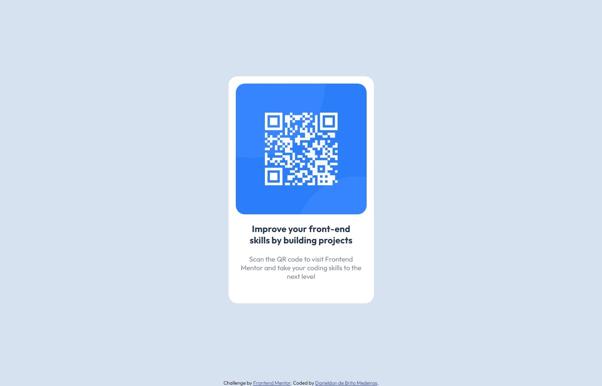

# Frontend Mentor - QR code component solution

[](https://github.com/DarieldonMedeiros/qr-code-component/blob/main/LICENSE)

Aqui está a solução do  [QR code component challenge on Frontend Mentor](https://www.frontendmentor.io/challenges/qr-code-component-iux_sIO_H). Os desafios do Frontend Mentor ajudam a melhorar os conhecimentos de programação, ao desenvolver projetos realísticos. Essse projeto é um site simples que contém um QR code que redireciona para o link da página do [Frontend Mentor](https://www.frontendmentor.io).

## Índice

- [Vizualização da Página](#vizualização-da-página)
  - [Layouts](#layouts)
  - [Links](#links)
- [Procedimento Realizado](#procedimento-realizado)
  - [Tecnologias Utilizadas](#tecnologias-utilizadas)
  - [O Que Eu Aprendi](#o-que-eu-aprendi)
- [Autor](#autor)


## Vizualização da Página

### Layouts

#### Layout Mobile


#### Layout Web



### Links

- Site da Solução: [Clique aqui!](https://darieldonmedeiros.github.io/qr-code-component/)

## Procedimento Realizado

### Tecnologias Utilizadas

- HTML5
- CSS3


### O Que Eu Aprendi

Com esse projeto, eu aprendi a colocar um elemento destacado no meio da tela, através do CSS que está abaixo. As cores e as fontes utilizadas estão no [Guia de Estilo](./style-guide.md).


```css
.container {
    width: 100vw;
    height: 100vh;
    display: flex;
    flex-direction: column;
    justify-content: center;
    align-items: center;
    
}

.box {
    /** imagem: width 288, height 288 espaçamento: 16px */
    width: 320px;
    height: 500px;
    background: hsl(0, 0%, 100%);
    border-radius: 20px;
    padding: 16px;

}
```

## Autor

- Github - [Darieldon de Brito Medeiros](https://github.com/DarieldonMedeiros)
- Frontend Mentor - [@DarieldonMedeiros](https://www.frontendmentor.io/profile/DarieldonMedeiros)
- Twitter - [@Darieldon](https://twitter.com/Darieldon)


